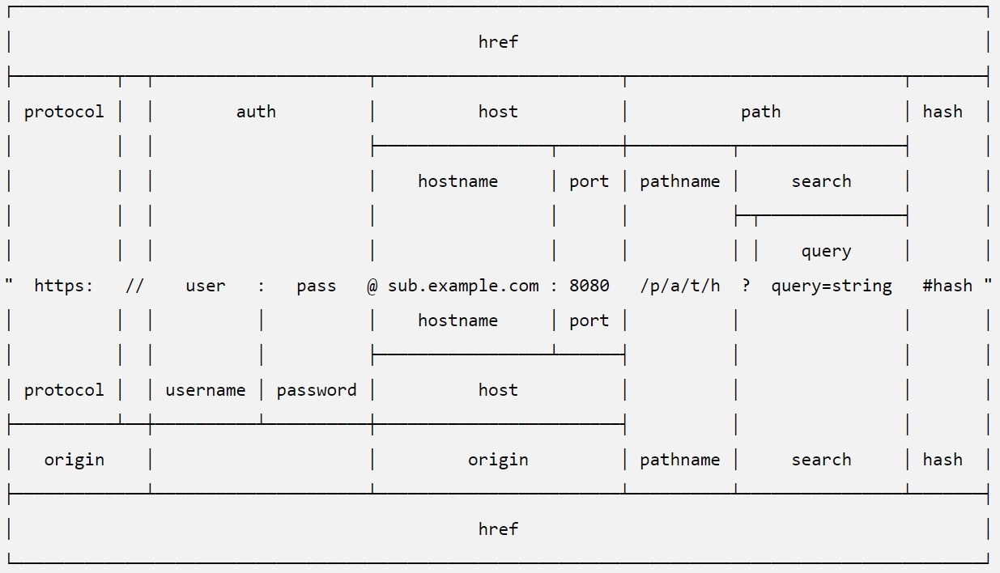

## 1. 용어정리
1. ERP - Enterprise Resource Planning(전사적 자원관리)
2. Deep(Machine) Learning - AI를 위한 컴퓨터의 학습
3. Big Data
4. AI - artificial intelligence(인공지능)
5. CRM - Customer Relationship management
6. MRP - Material requirements planning(자재소요계획)

## 2. 웹 용어 정리
1. browser - Internet에 접속하기 위한 Application
2. Application(App) - 응용프로그램
3. URL - Uniform Resource Locator
	 
	[URL 체계도 링크](https://nodejs.org/dist/latest-v12.x/docs/api/url.html)
4. href - hyperlink reference
5. protocol - 규약/규칙
6. http - hyper text transfer protocol(port: 80)
7. https - hyper text transfer protocol secure(port: 443)
8. host - 컴퓨터의 IP/Domain [hostname : port(생략가능)]
9. path - /gbook/api(pathname)?id=9(query)#page1(hash)
10. node에서 
```txt
/gbook/:id -> /gbook/11 -> req.params.id
/gbook -> /gbook?id=11 -> req.query.id
```
11. ftp(21) - File transfer protocol -> app: filezilla
12. sftp(22) - secure ftp -> app: filezilla
12. telnet(23) - remote host (원격컴퓨터)에 접근하는 프로토콜 -> app: cmd, bash, terminal(osx), putty(win)
13. 보안tennet - ssh(22)
14. mail(25)

## 3. database 용어 정리
0. DBMS(DataBase Management System) - MySQL/MariaDB, MSSQL, MongoDB, Oracle, PostgreSQL
1. SQL - Structured Query Language
2. row/record (SQL - 엑셀의 한줄-가로줄)
3. column (SQL - 엑셀의 세로줄)
4. table (SQL - 데이터들의 집합체 - 엑셀의 sheet)
5. database (SQL - 테이터들의 집합인 table들의 집합체 - xlsx)
6. document (NoSQL의 row == json)
7. collection (NoSQL의 Table == json 덩어리들)
8. database (NoSQL의 database)
9. scheme - 구조
10. ERD - Entity-Relationship Diagram - table 간의 관계도